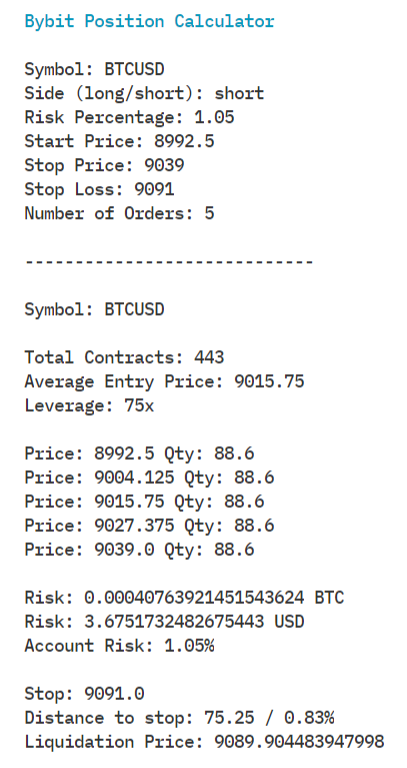

# trade-manager

Tool used to generate new positions on [Bybit](https://www.bybit.com). Calculates maximum leverage and orders to be placed using a user defined range and a user defined stop loss.

To use enter your account balance in `main.py`

## Info

`Symbol` Ticker name, only tickers on Bybit are supported ex. "BTCUSD", "XRPUSD"

`Side` Generate a long or short position (enter "long" or "short")

`Risk Percentage` This is the percentage of your account you want to risk.

`Start Price` Price to start longing or shorting at

`Stop Price` Price to stop longing or shorting at

`Stop Loss` Stop loss price

`Number of Orders` The number of orders to be generated within your longing or shorting range.

## Example

