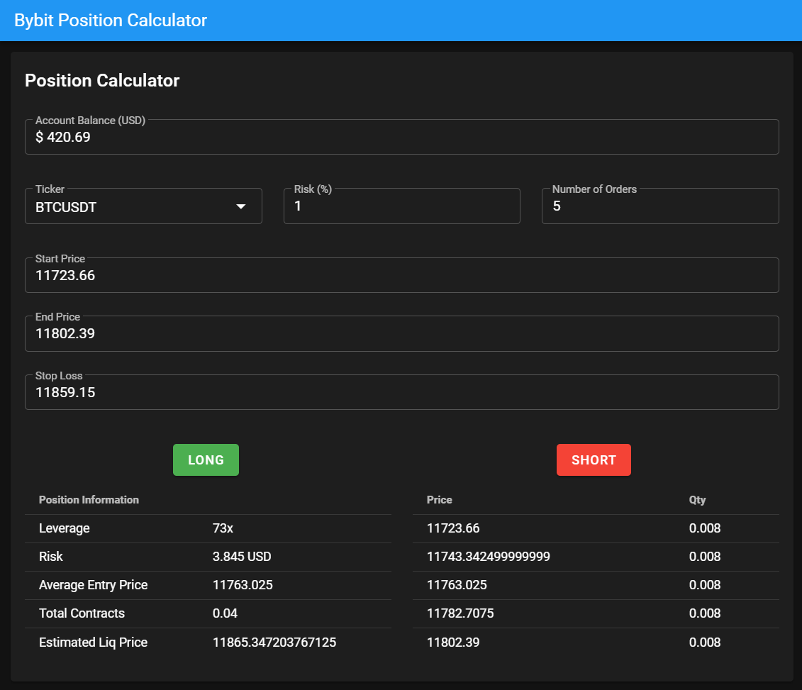

# bybit-position-calculator

Now supports USDT contract!!

Tool used to create new positions on [Bybit](https://www.bybit.com). Generates orders and calculates maximum leverage using a user defined order range and stop loss.



## Build / Setup

``` bash
# install dependencies
npm install

# serve with hot reload at localhost:9080
npm run dev

# build electron application for production
npm run build
```
